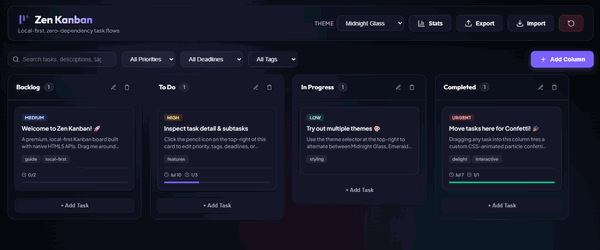

# 🧘‍♂️ Zen Kanban

A beautiful, zero-dependency, local-first Kanban board built purely with vanilla HTML5, CSS3, and ES6 JavaScript. Focus on your tasks with zero setup, absolute privacy, and instant responsiveness.

<!-- DEMO_GIF_PLACEHOLDER -->


---

## ✨ Features

- **⚡ Native Drag-and-Drop:** Built using HTML5 `dragstart`, `dragover`, `dragleave`, and `drop` events with smooth visual placement indicators.
- **🎨 Glassmorphic Themes:** Multiple tailored HSL-based presets including **Midnight Glass**, **Emerald Oasis**, **Cyberpunk Neon**, **Nordic Ice**, and **Sunset Glow**.
- **📊 Analytics Dashboard:** A collapsible top panel showing total tasks, completion rates (radial progress), overdue counts, and urgent/high metrics.
- **📝 Rich Card Properties:**
  - Priority levels (Low, Medium, High, Urgent).
  - Due date indicator badges (color-coded for upcoming, today, or overdue).
  - Fully checklist-driven subtasks with an interactive progress bar.
  - Categorization via tags.
- **🔍 Quick Filters:** Fast, real-time search across task names, descriptions, and tags. Multi-select filters for priority, deadlines, and tags.
- **🔄 Actions & History:** Toast notifications for actions (deletion, move) with an instant **Undo** buffer.
- **📂 State Portability:** Complete export/import of board states as JSON files. Easily backup or migrate your workspace in a single click.

---

## 🛠️ Technology Highlights

- **Zero dependencies, zero build steps:** No Node.js, `npm`, webpack, or library bundles. Just raw web platform APIs.
- **Offline & Private:** All data persists inside your browser's `localStorage`. No data is sent to external servers.
- **Responsive Layout:** Beautiful typography (Outfit & Plus Jakarta Sans) and responsive fluid resizing for varying screens.
- **HTML5 Drag Mechanics:**
  - Implements card reordering by computing mouse coordinate intersections relative to neighboring cards on the fly.
  - Uses CSS custom properties and transition layers to display interactive placeholder guides (`.drop-indicator`).
  - Native column rearranging by dragging headers.

---

## 🚀 How to Run

1. **Clone/Download** this repository.
2. Open [index.html](file:///index.html) directly in any modern web browser.
3. *Alternatively,* serve it locally with a simple HTTP server:
   ```bash
   # Python 3
   python -m http.server 8000
   
   # Node.js
   npx serve .
   ```

---

## 📄 License

MIT. Feel free to clone, customize, and self-host for your personal or team workflows!
